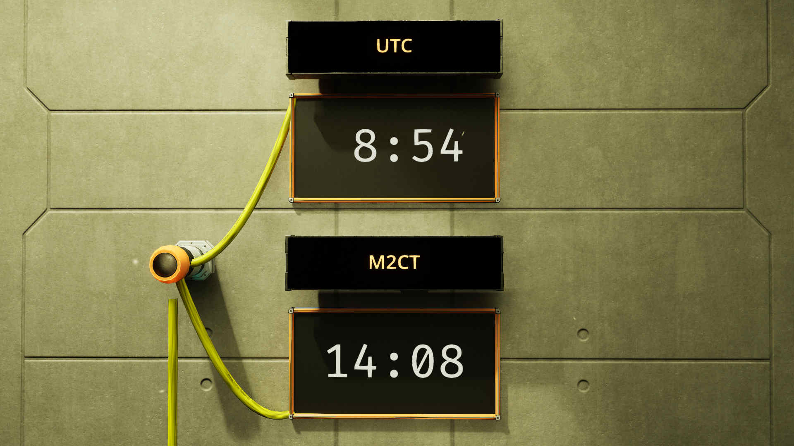

# The Ficsit multi-screen and multi-timezone clock
The Ficsit multi-screen and multi-timezone clock displays the time on one or multiple screens.

Example setup of the Ficsit multi-screen and multi-timezone clock

## Setup and installation
Please consider the following when installing your clocks:
- One GPU T1 per screen is required.
- Each screen needs to have its nick configured as follows:
    - clock
    - tz="<desired time zone>"

A complete nick would look like this:
    `clock tz="UTC"`

### Available timezones
Currently, two timezones are available; the aforementioned UTC, plus M2CT. This stands for Massage-2(A-B)b Coordinated Time. When the tz has not been set, it will default to M2CT.

### Alternative screen nick
If you would like to give your screens a nick other than "clock", you can do so via the computer's nick:
    `screen="mystring"`
