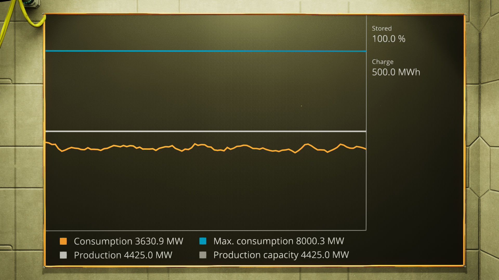
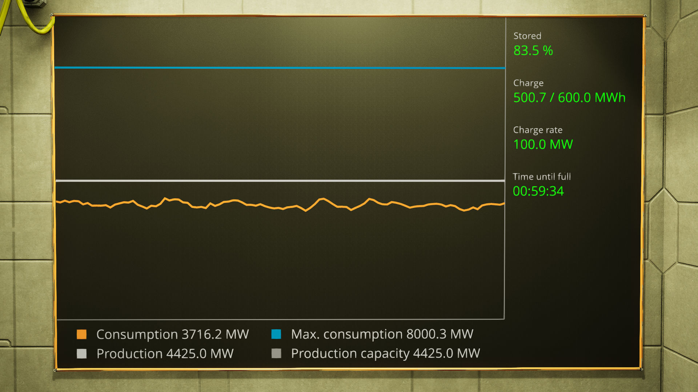
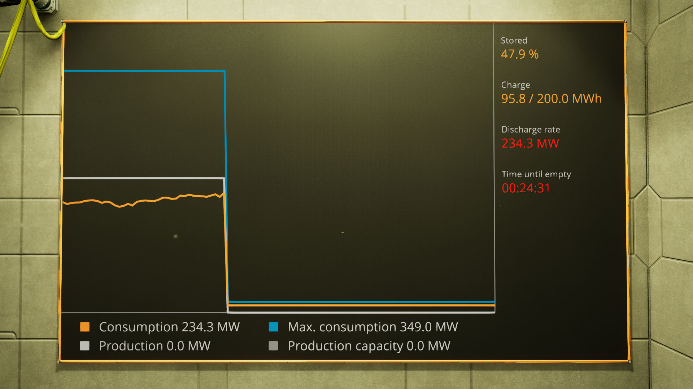
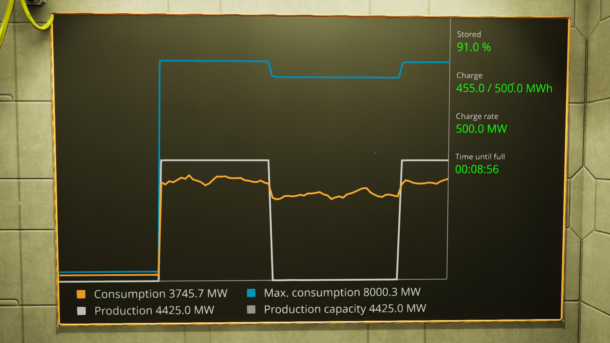

# The Ficsit Power Monitor
The Ficsit Power Monitor displays a power graph and power storage charge / discharge information.

## Setup
Hook a computer up to both a screen and a power connector. The computer must have a GPU T2.

You may specify which screen to use by adding the screen's nick to
the computer's nick. For example, say your screen has "powerMonitor" as its
nick, then you should add the following to your computer's nick:
    `screen="powerMonitor"`

Caveat: this software was written for a screen 10 m wide and 6 m tall and may not work properly with screens of different dimensions.

## Operation
The Ficsit Power Monitor will show a graph of power production and consumption, as well as maximum consumption and production capacity. Additionally, it will display power storage status when applicable.

## Examples
Examples of the Ficsit Power Monitor in operation are shown below.

An example of the Ficsit Power Monitor with fully charged power storages

An example of the Ficsit Power Monitor while charging

An example of the Ficsit Power Monitor while discharging

An example of the Ficsit Power Monitor when power storage is nearly full
